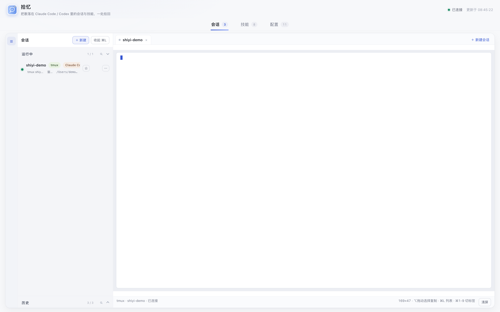
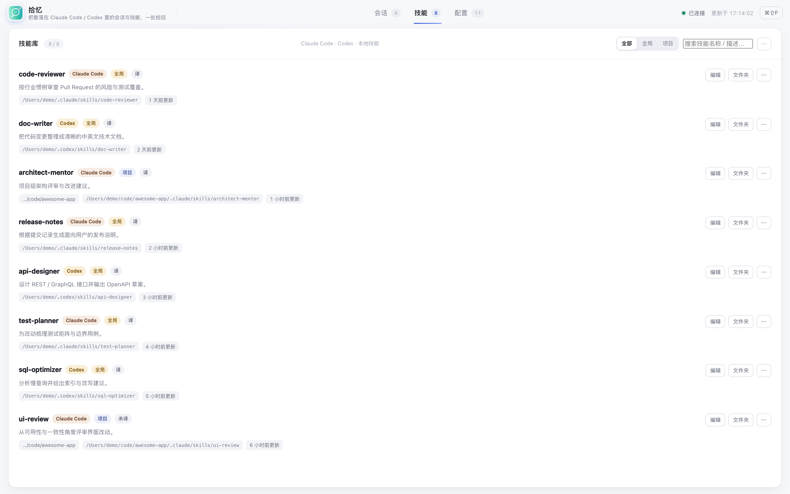
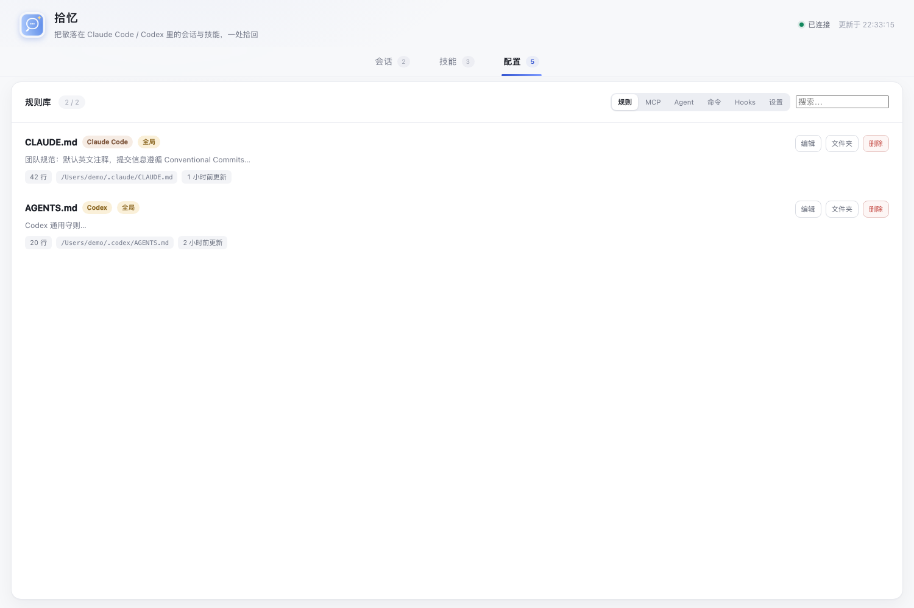

# 拾忆（Shiyi）

> 把散落在 Claude Code / Codex 里的会话与技能，一处拾回。


[](https://github.com/wp763691/shiyi/releases/latest)

## 截图

### 会话工作台



### 技能库



### 配置中心



## English

[README.en.md](README.en.md)

拾忆是一个**本地优先**的 macOS 桌面工具：实时查看正在运行的 AI 编码会话、检索全部历史会话并一键恢复，同时统一管理 Claude Code / Codex 的技能、规则、MCP、Agent、命令与 Hooks。

数据全部留在本机，不依赖任何云端服务。

## 功能概览

- **会话**：运行窗口 / tmux 实时映射、历史检索、一键恢复（iTerm → Terminal.app → 复制命令三级降级）、新建 / 终止会话
- **内置终端**：基于 tmux + 系统 Python PTY 桥的终端工作台，多标签、自适应、清屏、复制粘贴
- **技能**：全局 / 项目两级浏览，搜索、编辑、删除到回收
- **配置**：规则 / MCP（含连通性检测）/ Agent / 命令 / Hooks / 配置文件编辑器（JSON/TOML 语法高亮 + 自动备份）
- **隐私**：服务只监听 `127.0.0.1`；删除采用"移入本地回收目录"

## 目录与文件说明

```text
Shiyi/
├── app/                          # 应用本体
│   ├── server.mjs                # 本地 HTTP 服务入口（Node 零依赖）
│   ├── package.json              # 名称 / 脚本 / 引擎要求
│   ├── lib/                      # 后端功能模块（见下表）
│   ├── public/                   # 前端单页与资源
│   │   ├── index.html            # 页面结构（Tab 工作台 + 弹层）
│   │   ├── app.js                # 前端逻辑（渲染、终端、交互）
│   │   ├── style.css             # 界面样式（明亮主题）
│   │   ├── brand.png             # 页面左上角 Logo
│   │   └── vendor/xterm/         # xterm.js 5.3（终端渲染，Apache-2.0）
│   ├── macos/                    # macOS 原生壳与图标
│   │   ├── main.swift            # Swift + WKWebView 应用壳（含编辑菜单）
│   │   ├── Info.plist            # 应用元数据与网络策略
│   │   ├── build_app.sh          # 一键打包 .app
│   │   ├── make_icon.swift       # 图标绘制脚本（生成 1024 PNG）
│   │   ├── AppIcon.icns          # 应用图标（构建时打入）
│   │   └── .build/               # 构建产物目录（不入库）
│   ├── path-aliases.example.json # 路径别名示例（目录改名时用）
│   └── path-aliases.json         # 本机路径映射（不入库，如 ZYin→Shiyi）
├── docs/
│   ├── architecture.md           # 架构说明与数据源清单
│   ├── requirements.md           # 早期「知音」产品需求稿（存档）
│   └── 安装说明.md                # 目标 Mac 安装依赖与步骤
├── scripts/
│   ├── setup.sh                  # 安装可选依赖（iTerm Python API venv）
│   └── migrate-codex-path.mjs    # 目录改名后迁移 Codex 会话路径
├── dist/                         # Release 压缩包（不入库）
├── LICENSE                       # MIT 许可证
├── .gitignore                    # 忽略构建产物 / 虚拟环境 / 本地配置
└── README.md                     # 本文件
```

### app/lib 模块说明

| 文件 | 职责 |
|---|---|
| `sessions.mjs` | 扫描 Claude Code / Codex 会话，路径别名映射，删除到回收 |
| `skills.mjs` | 技能扫描（全局 + 项目），范围与来源识别 |
| `registry.mjs` | 规则 / MCP / Agent / 命令 / Hooks 扫描与 MCP 连通性检测 |
| `tmux.mjs` | tmux 会话 / 窗格探测 |
| `termproxy.mjs` | 内置终端会话管理（attach / 输入 / 关闭 / SSE 流） |
| `pty_bridge.py` | 系统 Python 实现的 PTY 桥（零依赖） |
| `terminal.mjs` | iTerm / Terminal.app 自动化：聚焦、恢复、接管、终止进程 |
| `iterm_open.py` | iTerm2 Python API 建标签辅助脚本 |
| `configfiles.mjs` | Claude settings.json / Codex config.toml 读取、校验与备份保存 |

## 快速开始

### 开发文档

- [AGENTS.md](./AGENTS.md)：给 AI / 开发者的速查（目录、命令、关键不变量）
- [docs/DEVELOPMENT.md](./docs/DEVELOPMENT.md)：完整开发文档（架构、数据流、API、已知坑、发布流程）

### 开发模式（浏览器面板）

```bash
bash scripts/setup.sh          # 可选：为 iTerm 一键恢复准备 venv
cd app
node server.mjs                # 打开 http://127.0.0.1:8787
```

### 打包 macOS 应用

```bash
bash app/macos/build_app.sh
open "app/macos/.build/拾忆.app"
```

## 依赖

- Node.js 18+（运行服务）
- tmux（内置终端）
- Claude Code / Codex CLI（会话功能）
- iTerm2（可选，开启 Enable Python API 后可一键恢复 iTerm 标签）

## 目录改名后怎么办

在 `app/path-aliases.json` 登记 `old → new`（参考 `path-aliases.example.json`），再运行 `scripts/migrate-codex-path.mjs` 做物理迁移。

## License

[MIT](./LICENSE)
